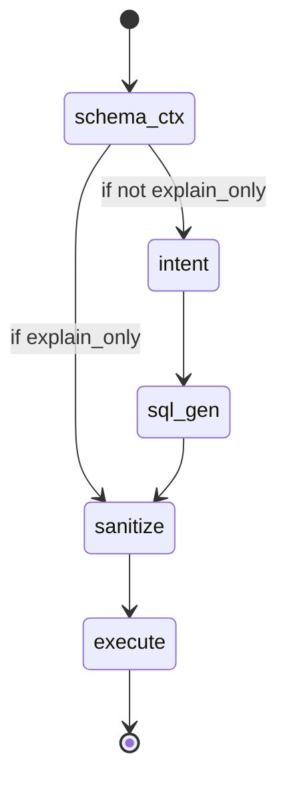

# NL2SQL Agents: Architecture and Orchestration

This document describes the agents (nodes) used in the NL2SQL pipeline and how they are orchestrated as a state graph.

## Agents (Nodes) and Their Responsibilities

### 1. `schema_ctx`
- **Purpose:** Loads the database schema context (from cache or live DB).
- **Behavior:**
  - If the user only wants an explanation (`explain_only`), routes to `sanitize`.
  - Otherwise, routes to `intent`.

### 2. `intent`
- **Purpose:** Analyzes the user's question to extract intent and entities (e.g., what is being asked, which tables/fields are relevant).

### 3. `sql_gen`
- **Purpose:** Generates a SQL query based on the schema and the extracted intent/entities.

### 4. `sanitize`
- **Purpose:** Cleans and validates the generated SQL (removes unsafe statements, ensures syntax is correct).

### 5. `execute`
- **Purpose:** Runs the sanitized SQL query against the database and collects results.

---

## Orchestration: State Graph

The agents are orchestrated using a state graph (see `graph.py`). The flow is as follows:

- The process starts at `schema_ctx`.
- Conditional routing after `schema_ctx` depends on the user's request.
- Each agent receives the current state, processes its part, and passes the updated state to the next agent.
- The flow is modular, robust, and easy to extend.

---

## Summary

- Each agent is responsible for a single step in the NL2SQL workflow.
- The state graph allows for flexible, maintainable orchestration.
- This design enables clear separation of concerns and easy extensibility for future enhancements.
