# AQ-NEW-NL2SQL

Repository structure

```
AQ-NEW-NL2SQL/
├─ .env.example                 # Sample env vars with placeholders (copy to .env)
├─ .gitignore                   # Ignore caches, env files, IDE cruft
├─ DATABASE_SETUP/              # SQL migrations and helpers for Azure SQL
│  ├─ README.md
│  ├─ contoso_fi_extensions.sql
│  ├─ migrations/
│  │  └─ 001_extend_domain.sql
│  ├─ run_migrations.py         # Applies migrations; reads AZURE_SQL_* env vars
│  └─ schema_cache.json         # Cached DB schema (for prompt context)
├─ docs/                        # Documentation and diagrams
│  ├─ CONTOSO-FI_DATASET_GUIDE.md
│  ├─ CONTOSO-FI_EXAMPLE_QUESTIONS.txt
│  ├─ CONTOSO-FI_EXAMPLE_SOLUTIONS.md
│  ├─ NL2SQL_PIPELINE_FLOW.md
│  └─ diagrams/
│     ├─ .gitignore
│     ├─ nl2sql_data_lineage.mmd
│     ├─ nl2sql_flowchart.mmd
│     ├─ nl2sql_sequence.mmd
│     └─ nl2sql_flowchart.svg   # Auto-generated from the Mermaid flowchart
├─ RESULTS/                     # Saved outputs from runs (logs, SQL, results)
│  └─ nl2sql_run_*.txt          # Timestamped run artifacts
├─ nl2sql_main.py               # Main NL→SQL pipeline entrypoint (Azure OpenAI)
├─ old_main.py                  # Earlier prototype (kept for reference)
├─ schema_reader.py             # Reads/caches DB schema for prompting
├─ sql_executor.py              # Executes SQL against Azure SQL via pyodbc
└─ README.md
```

# NL2SQL-only Entrypoint

This folder contains `nl2sql_main.py`, a focused version of the pipeline that implements only the NL→Intent→SQL flow. It mirrors the sequence and comments of `AQ-NEW-NL2SQL/main.py` but excludes any DAX functionality.

## What it does
- Extract intent/entities from a natural language question (Azure OpenAI via LangChain)
- Generate a T-SQL query using schema-aware prompting
- Sanitize/extract the T-SQL code
- Execute against Azure SQL Database via `pyodbc`
- Print results in a table and save the full run output to a timestamped file

## Prerequisites
- Install dependencies from the repo’s `requirements.txt`
- Provide a `.env` (use `.env.example` as a starting point) with:
  - AZURE_OPENAI_API_KEY
  - AZURE_OPENAI_ENDPOINT
  - AZURE_OPENAI_DEPLOYMENT_NAME
  - AZURE_SQL_SERVER
  - AZURE_SQL_DB
  - AZURE_SQL_USER
  - AZURE_SQL_PASSWORD
- Ensure Microsoft ODBC Driver 18 for SQL Server is installed on macOS:
  - brew tap microsoft/mssql-release
  - brew install msodbcsql18

## Quick start
```bash
# Show script purpose
python AQ-NEW-NL2SQL/nl2sql_main.py --whoami

# Interactive prompt for the question
python AQ-NEW-NL2SQL/nl2sql_main.py

# Provide the question inline
python AQ-NEW-NL2SQL/nl2sql_main.py --query "List the top 5 customers by total credit"

# Generate SQL but skip execution
python AQ-NEW-NL2SQL/nl2sql_main.py --query "Average balance per customer" --no-exec
```

Output logs will be written in this folder as `nl2sql_run_<query>_<timestamp>.txt`.

## How to run with decision flags (matches the flowchart)

Use these flags to control the decision points shown in the NL→SQL flow:

- --refresh-schema: Refresh the cached DB schema before generation (ensures up-to-date context)
- --no-reasoning: Skip the optional “SQL Generation Reasoning” step
- --explain-only: Print only Intent & Entities and the Reasoning summary; skip SQL generation and execution
- --no-exec: Generate SQL but do not execute it against the database
- --query "...": Provide the natural language question inline (otherwise you’ll be prompted)

Examples

```bash
# Full run (default): Intent → Reasoning → SQL → Execute
python nl2sql_main.py --query "Show the 10 most recent loans"

# Refresh schema first, then run end-to-end
python nl2sql_main.py --query "Weighted average interest rate by region" --refresh-schema

# Reasoning only (no SQL produced, no execution)
python nl2sql_main.py --query "List collateral items valued above 1,000" --explain-only

# Generate SQL but skip execution
python nl2sql_main.py --query "For each company, compute the total outs" --no-exec

# Faster run without the reasoning summary
python nl2sql_main.py --query "For each region, list the top 5 companies by balance" --no-reasoning
```

## Components

- `nl2sql_main.py`: CLI entrypoint that:
  - Loads env vars, wires LangChain with Azure OpenAI
  - Pulls schema context from `schema_reader.py`
  - Prompts for SQL, sanitizes and optionally executes via `sql_executor.py`
  - Writes outputs into `RESULTS/`
- `schema_reader.py`: Builds a compact schema context from Azure SQL (with a TTL cache) used to steer SQL generation.
- `sql_executor.py`: Executes T-SQL using pyodbc with connection details from env vars.
- `DATABASE_SETUP/`: SQL artifacts and `run_migrations.py` to set up/extend the Contoso FI sample.
- `docs/`: Guides and Mermaid diagrams. The flowchart SVG is generated from Mermaid sources.
- `RESULTS/`: Timestamped logs from pipeline runs; consider ignoring in `.gitignore` if you don’t want to commit them.

## Database setup (optional)

If you need to provision/extend the sample schema in Azure SQL, see `DATABASE_SETUP/README.md` and run `DATABASE_SETUP/run_migrations.py` after setting your AZURE_SQL_* environment variables.

## Diagrams

End-to-end NL→SQL flowchart (generated from `docs/diagrams/nl2sql_flowchart.mmd`):

<p align="center">
  
  <br />
  <em>High-level flow from NL question to SQL generation and execution.</em>
  
</p>

