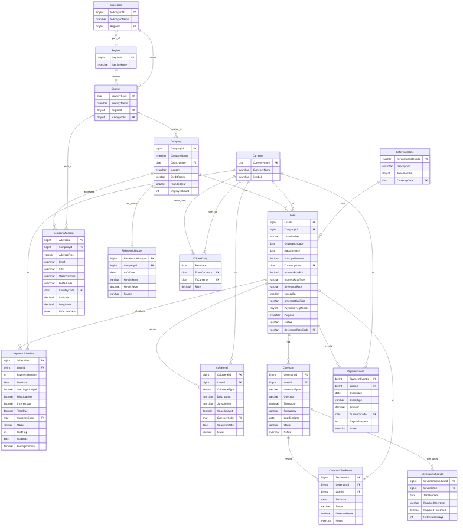

# CONTOSO-FI Schema Summary, Use Cases, and Diagram

Date: 2025-09-03

This document provides an executive summary of the CONTOSO-FI schema, common demo use cases, and an embedded ER diagram for quick reference.

## Summary

- Domain: Commercial lending portfolio analytics (loans, companies, cashflows, compliance, collateral)
- Core tables: Company, Loan, PaymentSchedule, PaymentEvent, Collateral, Covenant, CovenantTestResult, CovenantSchedule
- Reference data: Currency, ReferenceRate, Country, Region, Subregion, FXRateDaily
- Typical joins: Loan → Company → Country → Region; Loan → PaymentSchedule/PaymentEvent; Loan → Collateral; Loan → Covenant → Test/Schedule

## Demo-friendly use cases

1) Portfolio pulse
   - Show the most recent loans by OriginationDate
   - Top companies by total principal per region

2) Cashflows and delinquency
   - Paid vs Unpaid payment schedule counts
   - Delinquency buckets (PaymentEvent.DaysDelinquent) by region for recent months

3) Coverage and risk
   - Total collateral value per loan and company (top 20)
   - Covenant compliance rate by industry and quarter

4) Rate structure and currency
   - Weighted average interest rate by region and currency (weighted by PrincipalAmount)
   - Mix of fixed vs variable loans by region, including ReferenceRate context

## ER Diagram

> Source Mermaid file: `docs/diagrams/contoso_fi_schema.mmd`