# nl2sql_next

Natural Language to SQL pipeline — simple chain architecture, February 2026.

## What this is

A lightweight NL→SQL pipeline that converts plain-English questions into
T-SQL queries and executes them against an Azure SQL database. No framework
dependencies — just a prompt + Azure OpenAI Responses API + pyodbc.

It also includes a **DB Assistant** mode that answers schema, design, and
best-practice questions directly — without running any SQL.

Users can switch between **three model options** from the UI:
- **GPT-4.1** — fast, deterministic (temperature=0)
- **GPT-5.2 (low reasoning)** — reasoning model with low effort
- **GPT-5.2 (medium reasoning)** — reasoning model with medium effort

The target database is **RetailDW**, an E-Commerce/Retail star schema hosted
on Azure SQL with Entra ID-only authentication.

## Architecture

```mermaid
flowchart TD
    A["🗣️ User Question"] --> B{"🔀 Intent Router<br/><i>gpt-4.1 classifier ≤20 tokens</i>"}

    B -- "admin_assist" --> C["💬 DB Assistant<br/><i>Answer directly — no SQL</i>"]
    B -- "data_query" --> D["📦 Schema Cache<br/><i>JSON · INFORMATION_SCHEMA + FKs + samples · 24h TTL</i>"]

    D -- "~12K chars context" --> E["🤖 Azure OpenAI<br/><i>gpt-4.1 / gpt-5.2 (user-selectable)</i><br/><i>Responses API · few-shot · conversation history</i>"]

    E -- "raw SQL" --> F{"🛡️ Safety Check<br/><i>blocks INSERT / UPDATE / DELETE / DROP / EXEC</i>"}

    F -- "validated SELECT" --> G[("🗄️ Azure SQL · Entra ID<br/><b>RetailDW</b>")]

    G -- "columns + rows" --> H["📊 Result"]
    G -- "error?" --> I["🔄 Error-Correction Loop<br/><i>up to 2 retries with error context</i>"]
    I --> E

    C --> J["📤 Response"]
    H --> J

    style A fill:#0f3460,stroke:#e94560,color:#fff
    style B fill:#16213e,stroke:#e94560,color:#e0e0e0
    style C fill:#1a3a2a,stroke:#4ecca3,color:#4ecca3
    style D fill:#16213e,stroke:#0f3460,color:#e0e0e0
    style E fill:#1a1a3e,stroke:#79c0ff,color:#79c0ff
    style F fill:#2a1a1a,stroke:#e94560,color:#e94560
    style G fill:#0d1117,stroke:#0f3460,color:#79c0ff
    style H fill:#16213e,stroke:#4ecca3,color:#4ecca3
    style I fill:#2a2a1a,stroke:#f0c040,color:#f0c040
    style J fill:#0f3460,stroke:#e94560,color:#fff
```



### Serving layer

```mermaid
flowchart LR
    UI["⚛️ React / Vite<br/><i>:5173 · dark chat UI · model selector</i>"]
    API["⚡ FastAPI<br/><i>:8000 · POST /api/ask · sessions</i>"]
    CORE["🧠 core/<br/><i>nl2sql · router · schema</i>"]

    UI -- "HTTP JSON" --> API --> CORE

    style UI fill:#16213e,stroke:#79c0ff,color:#79c0ff
    style API fill:#16213e,stroke:#e94560,color:#e94560
    style CORE fill:#16213e,stroke:#4ecca3,color:#4ecca3
```



## Directory layout

```
nl2sql_next/
├── .env                  # Azure OpenAI + SQL credentials (git-ignored)
├── .env.example          # Template — copy to .env
├── .gitignore
├── requirements.txt
├── README.md             # ← you are here
│
├── core/                 # Reusable modules
│   ├── __init__.py
│   ├── db.py             # Entra ID token-auth connection helper
│   ├── schema.py         # Schema extractor + JSON cache + LLM context builder
│   ├── nl2sql.py         # NL→SQL chain + admin assist + model selector
│   ├── router.py         # Intent classifier (data_query vs admin_assist)
│   └── few_shots.py      # 6 curated question→SQL examples for the prompt
│
├── api.py                # FastAPI backend (POST /api/ask, sessions, health)
├── cli.py                # Interactive REPL — ask questions, see SQL + results
├── start.sh              # One-command launcher (kills ports, starts backend + frontend)
├── test_schema.py        # Standalone schema extractor test
│
├── frontend/             # React + Vite + TypeScript chat UI
│   ├── src/App.tsx        # Chat component (messages, SQL viewer, data table)
│   ├── src/App.css        # Dark theme styles
│   └── package.json
│
├── database/             # Everything DB
│   ├── ddl/
│   │   ├── 01_dimensions.sql   # 7 dimension tables + 1 reference table
│   │   ├── 02_facts.sql        # 5 fact tables
│   │   └── 03_views.sql        # 4 analytical views
│   ├── seed/             # Python data-generation scripts
│   ├── run_ddl.py        # DDL execution helper
│   └── schema_cache.json # Auto-generated schema cache
│
├── agents/               # (legacy — LangGraph port, not used)
├── docs/                 # Diagrams, guides
└── results/              # Timestamped run output (git-ignored)
```

## Azure infrastructure

| Resource | Details |
|----------|---------|
| **Azure SQL Server** | `aq-nl2sql-next.database.windows.net` |
| **Database** | `RetailDW` (Gen5 Provisioned, 2 vCores) |
| **Resource Group** | `rg-nl2sql-next` (Sweden Central) |
| **Authentication** | Entra ID-only (MCAPS policy, no SQL auth) |
| **Azure OpenAI** | `r2d2-foundry-001.openai.azure.com`, deployments: `gpt-4.1`, `gpt-5.2` |
| **API** | Responses API (`api-version=2025-04-01-preview`) |

## Database schema (RetailDW)

**Star schema** — E-Commerce/Retail domain:

| Schema | Tables | Description |
|--------|--------|-------------|
| `dim` | DimDate, DimCustomer, DimProduct, DimStore, DimPromotion, DimShippingMethod, DimPaymentMethod | Dimension tables |
| `ref` | RefReturnReason | Reference lookup |
| `fact` | FactOrders, FactReturns, FactCustomerReview, FactWebTraffic, FactInventory | Fact tables |
| `dbo` | vw_MonthlySales, vw_ProductPerformance, vw_CustomerLifetimeValue, vw_InventoryStatus | Analytical views |

**Data volumes**: ~21K total rows (1,800 orders / 3,613 order lines, 3,000 customers, 500 products, 12,000 inventory records, etc.)

**Relationships**: 20 foreign key constraints linking all fact tables to their dimensions.

### Entity-Relationship diagram


## Getting started

```bash
# 1. Create .env (if not already done)
cp .env.example .env
# Fill in AZURE_OPENAI_API_KEY, AZURE_OPENAI_ENDPOINT, etc.

# 2. Ensure you're logged into Azure CLI (for Entra DB auth)
az login

# 3. Install frontend deps (first time only)
cd nl2sql_next/frontend && npm install && cd ..

# 4. Launch everything (kills stale ports, starts backend + frontend)
cd nl2sql_next
./start.sh
# Backend: http://localhost:8000
# Frontend: http://localhost:5173
```

Alternatively, use the CLI without the web UI:
```bash
source ../.venv/bin/activate
python cli.py
```

### Example session

```
=== NL2SQL Interactive CLI ===
Type a question in plain English. Type 'quit' to exit.

Question> What are the top 5 products by total revenue?

⏳ Generating SQL …

📝 SQL:
SELECT TOP 5 ProductId, ProductName, Category, Subcategory, Brand, TotalRevenue
FROM dbo.vw_ProductPerformance
ORDER BY TotalRevenue DESC

+----------+----------------------------+----------+------------+-----------+-------------+
| ProductId| ProductName                | Category | Subcategory| Brand     | TotalRevenue|
+----------+----------------------------+----------+------------+-----------+-------------+
| SKU-00467| NorthPeak Outerwear AK39   | Clothing | Outerwear  | NorthPeak | 24378.04    |
| SKU-00431| PureEssence Fragrance QK17 | Beauty   | Fragrance  | PureEsse…| 18197.49    |
| ...      | ...                        | ...      | ...        | ...       | ...         |
+----------+----------------------------+----------+------------+-----------+-------------+
(5 rows)
```

### Programmatic usage

```python
# Single-shot
from core.nl2sql import ask

result = ask("Which customers have the most returns?")
print(result["sql"])       # Generated T-SQL
print(result["columns"])   # ['CustomerId', 'FirstName', ...]
print(result["rows"])      # [[...], [...], ...]
print(result["error"])     # None if successful
print(result["retries"])   # 0 if first attempt succeeded
print(result["model"])     # 'gpt-4.1' (default)

# Use a reasoning model
result = ask("Complex analytical question", model_key="gpt-5.2-medium")

# Multi-turn conversation
from core.nl2sql import Conversation

conv = Conversation()
r1 = conv.ask("Top 5 products by revenue")
r2 = conv.ask("Now filter to Clothing only")    # uses conversation context
r3 = conv.ask("Show that as a percentage of total")

# Switch model mid-conversation
r4 = conv.ask("Complex analysis query", model_key="gpt-5.2-low")
```

## Sample questions to try

### Simple aggregations (use views)
- "What's the total revenue and profit for 2024?"
- "Which month had the highest sales?"
- "What are the top 5 products by revenue?"

### Multi-table JOINs
- "Show the top 10 customers by number of orders with their membership tier"
- "What is the average order value by payment method?"
- "Which shipping method has the highest average delivery cost?"

### Filtering + grouping
- "How many orders were placed per store in California?"
- "What are the best-selling products in the Electronics category?"
- "Show revenue by brand for Clothing"

### Date logic
- "Compare Q1 vs Q2 revenue for 2024"
- "Which day of the week gets the most orders?"

### CTEs / subqueries
- "What percentage of total revenue does each product category represent?"
- "Which customers placed orders above the average order value?"

### Cross-fact analysis
- "What's the average review rating for the top 10 best-selling products?"
- "Which products have the highest return rate?"

### Inventory
- "Which stores have the most items below reorder point?"
- "What's the total inventory value by category?"

### Edge cases
- "How many customers have never placed an order?"
- "Are there any products with no reviews?"
- "Tell me about sales" *(vague — tests the LLM's ability to pick a reasonable interpretation)*

### Multi-turn conversation chain (tests memory)
1. "Show monthly sales for 2024"
2. "Now show only Q4"
3. "Add profit margin percentage"
4. "Which month had the best margin?"

## Key design decisions

| Decision | Rationale |
|----------|-----------|
| **Simple chain, no framework** | ~250 lines core, zero overhead, easy to debug. LangGraph/MAF/Azure AI Agent overkill for single-turn NL2SQL. |
| **Responses API** (not Chat Completions) | Chat Completions being deprecated by Microsoft; Responses API is the forward path. |
| **Multi-model support** | Users can select gpt-4.1 (fast) or gpt-5.2 reasoning models (low/medium effort) per question. Router always uses cheap gpt-4.1. |
| **Intent routing** | Lightweight gpt-4.1 classifier (~20 tokens) routes to `data_query` or `admin_assist` mode before the main LLM call. |
| **Few-shot prompting** | 6 curated question→SQL examples covering JOINs, CTEs, views, date filtering, aggregations. |
| **Error-correction loop** | If SQL execution fails, the LLM gets the error and retries (up to 2x) before giving up. |
| **Conversation memory** | `Conversation` class tracks previous Q→SQL pairs so follow-ups like "now filter by Clothing" work. |
| **Entra ID-only auth** | MCAPS policy requires it. Token-based via `AzureCliCredential`. |
| **Schema cache with TTL** | Avoids querying `INFORMATION_SCHEMA` on every request. 24h default, force-refresh available. |
| **Safety guard** | Regex blocks destructive SQL (INSERT/UPDATE/DELETE/DROP/EXEC). Defense-in-depth with LLM instructions. |
| **React/Vite + FastAPI** | Full-stack: FastAPI serves the NL2SQL API with session management; React chat UI with model selector, mode badges, SQL viewer + data tables. |

## Status

| Step | Status |
|------|--------|
| Directory scaffold | ✅ Done |
| Azure OpenAI config (.env) | ✅ Done — gpt-4.1, Responses API |
| Azure SQL Server + DB creation | ✅ Done — Entra-only, Gen5 2 vCores |
| Star schema DDL (Retail) | ✅ Done — 13 tables, 4 views, 20 FKs |
| Seed data (~21K rows) | ✅ Done — via MSSQL MCP tools |
| Schema extractor + cache | ✅ Done — core/schema.py |
| NL2SQL chain (Responses API) | ✅ Done — core/nl2sql.py |
| Intent routing (data_query / admin_assist) | ✅ Done — core/router.py |
| DB Assistant mode | ✅ Done — schema, design & best-practice answers |
| Multi-model selector (gpt-4.1 / gpt-5.2) | ✅ Done — UI dropdown + per-request model_key |
| Interactive CLI | ✅ Done — cli.py |
| End-to-end tested | ✅ Done — JOINs, aggregations, safety blocking |
| Few-shot examples | ✅ Done — 6 curated patterns in core/few_shots.py |
| Error-correction loop | ✅ Done — up to 2 retries with error context |
| Conversation memory | ✅ Done — Conversation class, multi-turn follow-ups |
| FastAPI backend | ✅ Done — api.py (POST /api/ask, session management) |
| React/Vite frontend | ✅ Done — frontend/ (dark chat UI, SQL viewer, data table) |
| Model selector in UI | ✅ Done — dropdown: gpt-4.1, gpt-5.2-low, gpt-5.2-medium |
| Mode badges | ✅ Done — red Data Query / green DB Assistant / blue model badge |
| Welcome section with suggestions | ✅ Done — categorized example questions |
| Containerization / ACA deploy | ⬜ Not started |
