# nl2sql_next

Natural Language to SQL pipeline — simple chain architecture, February 2026.

## What this is

A lightweight NL→SQL pipeline that converts plain-English questions into
T-SQL queries and executes them against an Azure SQL database. No framework
dependencies — just a prompt + Azure OpenAI Responses API + pyodbc.

It also includes a **DB Admin Assistant** mode that answers schema, design, and
best-practice questions directly — and can **execute read and write operations**
against the database using native tool-use (Azure OpenAI Responses API function
calling). Write operations (INSERT, UPDATE, DELETE) are gated by a **frontend
approval UI** — the user must explicitly approve or reject before any data
modification is executed.

Users can switch between **three model options** from the UI:
- **GPT-4.1** — fast, deterministic (temperature=0)
- **GPT-5.2 (low reasoning)** — reasoning model with low effort
- **GPT-5.2 (medium reasoning)** — reasoning model with medium effort

The target database is **RetailDW**, an E-Commerce/Retail star schema hosted
on Azure SQL with Entra ID-only authentication.

The app is **containerized** (multi-stage Docker) and deployed to **Azure
Container Apps** with system-assigned managed identity for SQL authentication.

## Architecture

```mermaid
flowchart TD
    A["🗣️ User Question"] --> B{"🔀 Intent Router<br/><i>gpt-4.1 classifier ≤20 tokens</i>"}

    B -- "admin_assist" --> C["�️ DB Admin Assistant<br/><i>Tool-use loop · read/write</i>"]
    B -- "data_query" --> D["📦 Schema Cache<br/><i>JSON · INFORMATION_SCHEMA + FKs + samples · 24h TTL</i>"]

    C -- "tool_call?" --> T{"🔒 Security Gate<br/><i>T0: auto · T1: approval</i>"}
    T -- "T0 (read)" --> TA["⚡ Auto-execute<br/><i>list_tables · describe_table · run_read_query</i>"]
    T -- "T1 (write)" --> TB["⚠️ Approval Card<br/><i>UI shows SQL + Approve/Reject</i>"]
    TA --> C
    TB -- "approved" --> TC["✅ Execute & return to LLM"]
    TB -- "rejected" --> TD["❌ Rejection fed to LLM"]
    TC --> C
    TD --> C

    D -- "~12K chars context" --> E["🤖 Azure OpenAI<br/><i>gpt-4.1 / gpt-5.2 (user-selectable)</i><br/><i>Responses API · few-shot · conversation history</i>"]

    E -- "raw SQL" --> F{"🛡️ Safety Check<br/><i>blocks INSERT / UPDATE / DELETE / DROP / EXEC</i>"}

    F -- "validated SELECT" --> G[("🗄️ Azure SQL · Entra ID<br/><b>RetailDW</b>")]

    G -- "columns + rows" --> H["📊 Result"]
    G -- "error?" --> I["🔄 Error-Correction Loop<br/><i>up to 2 retries with error context</i>"]
    I --> E

    C --> J["📤 Response"]
    H --> J

    style A fill:#0f3460,stroke:#e94560,color:#fff
    style B fill:#16213e,stroke:#e94560,color:#e0e0e0
    style C fill:#1a3a2a,stroke:#4ecca3,color:#4ecca3
    style T fill:#2a2a1a,stroke:#f0c040,color:#f0c040
    style TA fill:#16213e,stroke:#4ecca3,color:#4ecca3
    style TB fill:#2a1a1a,stroke:#e94560,color:#e94560
    style TC fill:#1a3a2a,stroke:#4ecca3,color:#4ecca3
    style TD fill:#2a1a1a,stroke:#e94560,color:#e94560
    style D fill:#16213e,stroke:#0f3460,color:#e0e0e0
    style E fill:#1a1a3e,stroke:#79c0ff,color:#79c0ff
    style F fill:#2a1a1a,stroke:#e94560,color:#e94560
    style G fill:#0d1117,stroke:#0f3460,color:#79c0ff
    style H fill:#16213e,stroke:#4ecca3,color:#4ecca3
    style I fill:#2a2a1a,stroke:#f0c040,color:#f0c040
    style J fill:#0f3460,stroke:#e94560,color:#fff
```



### Serving layer

```mermaid
flowchart LR
    UI["⚛️ React / Vite<br/><i>:5173 · dark chat UI · model selector</i>"]
    API["⚡ FastAPI<br/><i>:8000 · POST /api/ask · sessions</i>"]
    CORE["🧠 core/<br/><i>nl2sql · router · schema</i>"]

    UI -- "HTTP JSON" --> API --> CORE

    style UI fill:#16213e,stroke:#79c0ff,color:#79c0ff
    style API fill:#16213e,stroke:#e94560,color:#e94560
    style CORE fill:#16213e,stroke:#4ecca3,color:#4ecca3
```



## Directory layout

```
nl2sql_next/
├── .env                  # Azure OpenAI + SQL credentials (git-ignored)
├── .env.example          # Template — copy to .env
├── .gitignore
├── requirements.txt
├── README.md             # ← you are here
│
├── core/                 # Reusable modules
│   ├── __init__.py
│   ├── db.py             # Entra ID / managed identity connection (DefaultAzureCredential)
│   ├── schema.py         # Schema extractor + JSON cache + LLM context builder
│   ├── nl2sql.py         # NL→SQL chain + admin tool-use loop + approval flow
│   ├── router.py         # Intent classifier (data_query vs admin_assist)
│   ├── tools.py          # Tool definitions, security tiers, execution engine
│   └── few_shots.py      # 6 curated question→SQL examples for the prompt
│
├── api.py                # FastAPI backend (POST /api/ask, /api/approve, sessions, health)
├── cli.py                # Interactive REPL — ask questions, see SQL + results
├── start.sh              # One-command launcher (kills ports, starts backend + frontend)
├── Dockerfile            # Multi-stage build (Node frontend + Python/ODBC runtime)
├── .dockerignore         # Docker build exclusions
├── deploy-aca.sh         # Full ACA deployment script (RG, ACR, ACA env, app, MI)
├── test_schema.py        # Standalone schema extractor test
│
├── frontend/             # React + Vite + TypeScript chat UI
│   ├── src/App.tsx        # Chat component (messages, SQL viewer, data table)
│   ├── src/App.css        # Dark theme styles
│   └── package.json
│
├── database/             # Everything DB
│   ├── ddl/
│   │   ├── 01_dimensions.sql   # 7 dimension tables + 1 reference table
│   │   ├── 02_facts.sql        # 5 fact tables
│   │   └── 03_views.sql        # 4 analytical views
│   ├── seed/             # Python data-generation scripts
│   ├── run_ddl.py        # DDL execution helper
│   └── schema_cache.json # Auto-generated schema cache
│
├── agents/               # (legacy — LangGraph port, not used)
├── docs/                 # Diagrams, guides
└── results/              # Timestamped run output (git-ignored)
```

## Azure infrastructure

| Resource | Details |
|----------|---------|
| **Azure SQL Server** | `aq-nl2sql-next.database.windows.net` |
| **Database** | `RetailDW` (Gen5 Provisioned, 2 vCores) |
| **Resource Group** | `rg-nl2sql-next` (Sweden Central) — SQL Server |
| **Authentication** | Entra ID-only (MCAPS policy, no SQL auth) |
| **Azure OpenAI** | `r2d2-foundry-001.openai.azure.com`, deployments: `gpt-4.1`, `gpt-5.2` |
| **API** | Responses API (`api-version=2025-04-01-preview`) |
| **Container Registry** | `aqnl2sqlnextacr.azurecr.io` (Basic SKU, East US 2) |
| **Container App** | `aq-nl2sql-next-app` (ACA, East US 2, system-assigned MI) |
| **ACA Environment** | `aq-nl2sql-next-aca-env` (East US 2) |
| **ACA Resource Group** | `aq-nl2sql-next-rg` (East US 2) |
| **Live URL** | `https://aq-nl2sql-next-app.orangegrass-878e4c2c.eastus2.azurecontainerapps.io` |

## Database schema (RetailDW)

**Star schema** — E-Commerce/Retail domain:

| Schema | Tables | Description |
|--------|--------|-------------|
| `dim` | DimDate, DimCustomer, DimProduct, DimStore, DimPromotion, DimShippingMethod, DimPaymentMethod | Dimension tables |
| `ref` | RefReturnReason | Reference lookup |
| `fact` | FactOrders, FactReturns, FactCustomerReview, FactWebTraffic, FactInventory | Fact tables |
| `dbo` | vw_OrderSummary, vw_MonthlySales, vw_ProductPerformance, vw_CustomerLifetimeValue | Analytical views |

**Data volumes**: ~50K total rows — see [docs/SCHEMA_REFERENCE.md](docs/SCHEMA_REFERENCE.md) for full breakdown.

| Table | Rows |
|-------|------|
| FactOrders | 20,043 |
| FactInventory | 12,000 |
| FactWebTraffic | 8,000 |
| FactCustomerReview | 5,000 |
| DimCustomer | 3,000 |
| FactReturns | 2,036 |
| DimDate | 1,461 |
| DimProduct | 500 |
| DimPromotion | 30 |
| DimStore | 25 |
| DimPaymentMethod | 8 |
| RefReturnReason | 8 |
| DimShippingMethod | 5 |

**Relationships**: 20 foreign key constraints linking all fact tables to their dimensions.

### Entity-Relationship diagram

```mermaid
erDiagram
    %% ── Dimension tables ──────────────────────────
    DimDate {
        INT DateKey PK
        DATE Date
        INT Year
        INT Quarter
        INT Month
        VARCHAR MonthName
        INT DayOfWeek
        VARCHAR DayName
        BIT IsWeekend
        BIT IsHoliday
    }

    DimCustomer {
        INT CustomerKey PK
        VARCHAR CustomerId
        NVARCHAR FirstName
        NVARCHAR LastName
        VARCHAR Gender
        VARCHAR AgeGroup
        NVARCHAR City
        NVARCHAR State
        VARCHAR Region
        VARCHAR MembershipTier
        BIT IsActive
    }

    DimProduct {
        INT ProductKey PK
        VARCHAR ProductId
        NVARCHAR ProductName
        VARCHAR Category
        VARCHAR Subcategory
        NVARCHAR Brand
        DECIMAL UnitCost
        DECIMAL UnitPrice
        BIT IsActive
    }

    DimStore {
        INT StoreKey PK
        VARCHAR StoreId
        NVARCHAR StoreName
        VARCHAR StoreType
        NVARCHAR City
        NVARCHAR State
        VARCHAR Region
    }

    DimPromotion {
        INT PromotionKey PK
        VARCHAR PromotionId
        NVARCHAR PromotionName
        VARCHAR PromotionType
        DECIMAL DiscountPercent
        DATE StartDate
        DATE EndDate
    }

    DimShippingMethod {
        INT ShippingMethodKey PK
        VARCHAR MethodName
        VARCHAR CarrierName
        INT AvgDeliveryDays
        DECIMAL BaseCost
    }

    DimPaymentMethod {
        INT PaymentMethodKey PK
        VARCHAR MethodName
        VARCHAR Provider
    }

    RefReturnReason {
        INT ReturnReasonKey PK
        VARCHAR ReasonCode
        VARCHAR ReasonName
    }

    %% ── Fact tables ───────────────────────────────
    FactOrders {
        INT OrderLineKey PK
        VARCHAR OrderId
        INT LineNumber
        INT Quantity
        DECIMAL UnitPrice
        DECIMAL DiscountAmount
        DECIMAL ShippingCost
        DECIMAL TaxAmount
        DECIMAL LineTotal
        DECIMAL LineCost
        DECIMAL LineProfit
        VARCHAR OrderStatus
        BIT IsReturned
    }

    FactReturns {
        INT ReturnKey PK
        VARCHAR ReturnId
        VARCHAR OrderId
        INT Quantity
        DECIMAL RefundAmount
        VARCHAR ReturnStatus
        BIT IsRefunded
    }

    FactCustomerReview {
        INT ReviewKey PK
        VARCHAR ReviewId
        INT Rating
        INT ReviewLength
        INT HelpfulVotes
        NVARCHAR ReviewTitle
        BIT IsVerifiedPurchase
        DECIMAL SentimentScore
    }

    FactWebTraffic {
        INT SessionKey PK
        VARCHAR SessionId
        INT PageViews
        INT SessionDurationSec
        BIT BounceFlag
        INT ProductsViewed
        BIT ConvertedFlag
        VARCHAR TrafficSource
        VARCHAR DeviceType
    }

    FactInventory {
        INT InventoryKey PK
        INT QuantityOnHand
        INT QuantityOnOrder
        INT ReorderPoint
        DECIMAL UnitCost
        DECIMAL InventoryValue
    }

    %% ── Relationships (20 FKs) ───────────────────
    DimCustomer  ||--o{ FactOrders          : "places"
    DimProduct   ||--o{ FactOrders          : "ordered in"
    DimDate      ||--o{ FactOrders          : "order date"
    DimDate      ||--o{ FactOrders          : "ship date"
    DimStore     ||--o{ FactOrders          : "sold at"
    DimPromotion ||--o{ FactOrders          : "applied to"
    DimShippingMethod ||--o{ FactOrders     : "shipped via"
    DimPaymentMethod  ||--o{ FactOrders     : "paid with"

    DimCustomer  ||--o{ FactReturns         : "returns"
    DimProduct   ||--o{ FactReturns         : "returned item"
    DimDate      ||--o{ FactReturns         : "return date"
    DimStore     ||--o{ FactReturns         : "returned at"
    RefReturnReason ||--o{ FactReturns      : "reason"

    DimCustomer  ||--o{ FactCustomerReview  : "writes"
    DimProduct   ||--o{ FactCustomerReview  : "reviewed"
    DimDate      ||--o{ FactCustomerReview  : "review date"

    DimCustomer  ||--o{ FactWebTraffic      : "visits"
    DimDate      ||--o{ FactWebTraffic      : "visit date"

    DimProduct   ||--o{ FactInventory       : "stocked"
    DimStore     ||--o{ FactInventory       : "held at"
    DimDate      ||--o{ FactInventory       : "snapshot date"
```



## Getting started

```bash
# 1. Create .env (if not already done)
cp .env.example .env
# Fill in AZURE_OPENAI_API_KEY, AZURE_OPENAI_ENDPOINT, etc.

# 2. Ensure you're logged into Azure CLI (for Entra DB auth)
az login

# 3. Install frontend deps (first time only)
cd nl2sql_next/frontend && npm install && cd ..

# 4. Launch everything (kills stale ports, starts backend + frontend)
cd nl2sql_next
./start.sh
# Backend: http://localhost:8000
# Frontend: http://localhost:5173
```

Alternatively, use the CLI without the web UI:
```bash
source ../.venv/bin/activate
python cli.py
```

### Example session

```
=== NL2SQL Interactive CLI ===
Type a question in plain English. Type 'quit' to exit.

Question> What are the top 5 products by total revenue?

⏳ Generating SQL …

📝 SQL:
SELECT TOP 5 ProductId, ProductName, Category, Subcategory, Brand, TotalRevenue
FROM dbo.vw_ProductPerformance
ORDER BY TotalRevenue DESC

+----------+----------------------------+----------+------------+-----------+-------------+
| ProductId| ProductName                | Category | Subcategory| Brand     | TotalRevenue|
+----------+----------------------------+----------+------------+-----------+-------------+
| SKU-00467| NorthPeak Outerwear AK39   | Clothing | Outerwear  | NorthPeak | 24378.04    |
| SKU-00431| PureEssence Fragrance QK17 | Beauty   | Fragrance  | PureEsse…| 18197.49    |
| ...      | ...                        | ...      | ...        | ...       | ...         |
+----------+----------------------------+----------+------------+-----------+-------------+
(5 rows)
```

### Programmatic usage

```python
# Single-shot
from core.nl2sql import ask

result = ask("Which customers have the most returns?")
print(result["sql"])       # Generated T-SQL
print(result["columns"])   # ['CustomerId', 'FirstName', ...]
print(result["rows"])      # [[...], [...], ...]
print(result["error"])     # None if successful
print(result["retries"])   # 0 if first attempt succeeded
print(result["model"])     # 'gpt-4.1' (default)

# Use a reasoning model
result = ask("Complex analytical question", model_key="gpt-5.2-medium")

# Multi-turn conversation
from core.nl2sql import Conversation

conv = Conversation()
r1 = conv.ask("Top 5 products by revenue")
r2 = conv.ask("Now filter to Clothing only")    # uses conversation context
r3 = conv.ask("Show that as a percentage of total")

# Switch model mid-conversation
r4 = conv.ask("Complex analysis query", model_key="gpt-5.2-low")
```

## Sample questions to try

### Simple aggregations (use views)
- "What's the total revenue and profit for 2024?"
- "Which month had the highest sales?"
- "What are the top 5 products by revenue?"

### Multi-table JOINs
- "Show the top 10 customers by number of orders with their membership tier"
- "What is the average order value by payment method?"
- "Which shipping method has the highest average delivery cost?"

### Filtering + grouping
- "How many orders were placed per store in California?"
- "What are the best-selling products in the Electronics category?"
- "Show revenue by brand for Clothing"

### Date logic
- "Compare Q1 vs Q2 revenue for 2024"
- "Which day of the week gets the most orders?"

### CTEs / subqueries
- "What percentage of total revenue does each product category represent?"
- "Which customers placed orders above the average order value?"

### Cross-fact analysis
- "What's the average review rating for the top 10 best-selling products?"
- "Which products have the highest return rate?"

### Inventory
- "Which stores have the most items below reorder point?"
- "What's the total inventory value by category?"

### Edge cases
- "How many customers have never placed an order?"
- "Are there any products with no reviews?"
- "Tell me about sales" *(vague — tests the LLM's ability to pick a reasonable interpretation)*

### Multi-turn conversation chain (tests memory)
1. "Show monthly sales for 2024"
2. "Now show only Q4"
3. "Add profit margin percentage"
4. "Which month had the best margin?"

## Containerization & Azure Container Apps deployment

### Docker image

Multi-stage build in `Dockerfile`:

1. **Stage 1 (Node 22-slim)**: Installs frontend deps (`npm ci`), runs `tsc -b && vite build`, produces `frontend/dist/`.
2. **Stage 2 (Python 3.13-slim)**: Installs Microsoft ODBC Driver 18 for SQL Server + `libgssapi-krb5-2`, installs Python deps, copies backend code + built frontend.

```bash
# Local build (for testing)
cd nl2sql_next
docker build -t nl2sql-next:test .
docker run --rm -p 8080:8000 \
    -e AZURE_OPENAI_API_KEY=... \
    -e AZURE_OPENAI_ENDPOINT=... \
    -e AZURE_SQL_SERVER=... \
    -e AZURE_SQL_DB=... \
    nl2sql-next:test
```

In production, FastAPI serves the built React frontend from `frontend/dist/` (SPA catch-all + `/assets` static mount). No separate web server needed.

### One-command ACA deployment

```bash
cd nl2sql_next && ./deploy-aca.sh
```

The `deploy-aca.sh` script performs all 7 steps:

| Step | What | Azure resource |
|------|------|----------------|
| 1 | Create resource group | `aq-nl2sql-next-rg` (eastus2) |
| 2 | Create Azure Container Registry | `aqnl2sqlnextacr` (Basic SKU) |
| 3 | Build & push image via ACR Tasks | Cloud build — no local Docker needed |
| 4 | Create ACA environment | `aq-nl2sql-next-aca-env` |
| 5 | Fetch ACR credentials | Admin credentials for image pull |
| 6 | Create/update ACA app | `aq-nl2sql-next-app` with secrets + env vars |
| 7 | Configure managed identity | System-assigned MI for SQL auth |

**After deployment**, grant the managed identity SQL access (one-time only):

```sql
-- Run in Azure SQL as an admin
CREATE USER [aq-nl2sql-next-app] FROM EXTERNAL PROVIDER;
ALTER ROLE db_datareader ADD MEMBER [aq-nl2sql-next-app];
ALTER ROLE db_datawriter ADD MEMBER [aq-nl2sql-next-app];
```

### Redeployment

To redeploy after code changes:

```bash
cd nl2sql_next

# Rebuild image in ACR
az acr build --registry aqnl2sqlnextacr \
    --image nl2sql-next:$(date +%Y%m%d-%H%M%S) \
    --image nl2sql-next:latest \
    --file Dockerfile .

# Update ACA app to use new image
az containerapp update \
    --name aq-nl2sql-next-app \
    --resource-group aq-nl2sql-next-rg \
    --image aqnl2sqlnextacr.azurecr.io/nl2sql-next:latest
```

Or simply re-run `./deploy-aca.sh` — it detects the existing app and updates it.

### Authentication flow

```mermaid
flowchart LR
    ACA["🐳 ACA Container<br/><i>system-assigned MI</i>"]
    SDK["DefaultAzureCredential<br/><i>azure-identity</i>"]
    SQL["🗄️ Azure SQL<br/><i>RetailDW</i>"]
    OAI["🤖 Azure OpenAI<br/><i>API key from ACA secret</i>"]

    ACA --> SDK
    SDK -- "ManagedIdentityCredential<br/>token" --> SQL
    ACA -- "secretref:azure-openai-key" --> OAI

    style ACA fill:#16213e,stroke:#79c0ff,color:#79c0ff
    style SDK fill:#1a3a2a,stroke:#4ecca3,color:#4ecca3
    style SQL fill:#0d1117,stroke:#0f3460,color:#79c0ff
    style OAI fill:#1a1a3e,stroke:#f0c040,color:#f0c040
```



- **Azure SQL**: `DefaultAzureCredential` automatically uses ManagedIdentityCredential in ACA, AzureCliCredential locally.
- **Azure OpenAI**: API key stored as an ACA secret (`azure-openai-key`), referenced in env vars as `secretref:azure-openai-key`.

### Obstacles encountered & fixes

| Issue | Root Cause | Fix |
|-------|-----------|-----|
| **ODBC driver "file not found"** | `libgssapi-krb5-2` (Kerberos GSSAPI) not installed — a transitive dependency of `msodbcsql18` not pulled in by `--no-install-recommends` | Added `libgssapi-krb5-2` to the `apt-get install` line in Dockerfile |
| **`--platform` in Dockerfile fails ACR** | ACR Tasks doesn't parse `FROM --platform=linux/amd64` syntax | Removed platform flags from Dockerfile — ACR Tasks builds on amd64 by default |
| **ODBC arch mismatch (local build)** | Docker Desktop on Apple Silicon builds ARM64 by default | Used `dpkg --print-architecture` for dynamic arch detection in the ODBC repo URL; works for both ARM64 (local) and amd64 (ACR) |
| **Frontend API calls fail in container** | `API_BASE = "http://localhost:8000"` hardcoded — doesn't work when frontend is served from same origin | Changed to `import.meta.env.VITE_API_BASE ?? ""` (empty = same origin); added Vite dev proxy (`/api` → `localhost:8000`) |
| **TypeScript build error (PieChart)** | `percent` possibly undefined in Recharts `PieLabelRenderProps` — stricter TS in container's fresh `npm ci` | Imported `PieLabelRenderProps` type, used `props.percent ?? 0` |
| **`AzureCliCredential` fails in container** | No `az` CLI in container | Switched `db.py` from `AzureCliCredential` to `DefaultAzureCredential` — auto-selects ManagedIdentityCredential in ACA |

### ACA app configuration

| Setting | Value |
|---------|-------|
| CPU / Memory | 1.0 vCPU / 2.0 GiB |
| Min / Max replicas | 0 / 3 (scale to zero) |
| Ingress | External, port 8000 |
| Identity | System-assigned managed identity |
| Secrets | `azure-openai-key` (from .env) |
| Env vars | `AZURE_OPENAI_*`, `AZURE_SQL_*`, `AZURE_SQL_AUTH=entra` |

## Key design decisions

| Decision | Rationale |
|----------|-----------|
| **Simple chain, no framework** | ~250 lines core, zero overhead, easy to debug. LangGraph/MAF/Azure AI Agent overkill for single-turn NL2SQL. |
| **Responses API** (not Chat Completions) | Chat Completions being deprecated by Microsoft; Responses API is the forward path. |
| **Native tool-use for admin** | LLM calls tools (list_tables, describe_table, run_read_query, run_write_query) in a loop. No external framework — just the Responses API `tools=` parameter. |
| **Security-tiered tools** | T0 (read) = auto-execute, T1 (write) = UI approval required. Defense-in-depth with SQL validation. |
| **Multi-model support** | Users can select gpt-4.1 (fast) or gpt-5.2 reasoning models (low/medium effort) per question. Router always uses cheap gpt-4.1. |
| **Intent routing** | Lightweight gpt-4.1 classifier (~20 tokens) routes to `data_query` or `admin_assist` mode before the main LLM call. Write operations (INSERT/UPDATE/DELETE) always route to admin_assist. |
| **Few-shot prompting** | 6 curated question→SQL examples covering JOINs, CTEs, views, date filtering, aggregations. |
| **Error-correction loop** | If SQL execution fails, the LLM gets the error and retries (up to 2x) before giving up. |
| **Conversation memory** | `Conversation` class tracks previous Q→SQL pairs so follow-ups like "now filter by Clothing" work. |
| **DefaultAzureCredential** | Works with both local `az login` (AzureCliCredential) and ACA managed identity (ManagedIdentityCredential) automatically. |
| **Schema cache with TTL** | Avoids querying `INFORMATION_SCHEMA` on every request. 24h default, force-refresh available. |
| **Multi-stage Docker** | Stage 1: Node 22 builds React/Vite frontend. Stage 2: Python 3.13-slim + ODBC Driver 18. Final image ~360MB. |
| **ACA deployment script** | One-command `deploy-aca.sh`: creates RG, ACR, builds image via ACR Tasks (cloud build), creates ACA env + app with managed identity and secrets. |
| **Static file serving** | In production (Docker), FastAPI serves the built React frontend from `frontend/dist/`. In dev, Vite proxies `/api` to localhost:8000. |
| **React/Vite + FastAPI** | Full-stack: FastAPI serves the NL2SQL API with session management; React chat UI with model selector, mode badges, SQL viewer, data tables, approval cards. |

## Status

| Step | Status |
|------|--------|
| Directory scaffold | ✅ Done |
| Azure OpenAI config (.env) | ✅ Done — gpt-4.1, Responses API |
| Azure SQL Server + DB creation | ✅ Done — Entra-only, Gen5 2 vCores |
| Star schema DDL (Retail) | ✅ Done — 13 tables, 4 views, 20 FKs |
| Seed data (~50K rows) | ✅ Done — via MSSQL MCP tools |
| Schema extractor + cache | ✅ Done — core/schema.py |
| NL2SQL chain (Responses API) | ✅ Done — core/nl2sql.py |
| Intent routing (data_query / admin_assist) | ✅ Done — core/router.py |
| DB Assistant mode | ✅ Done — schema, design & best-practice answers |
| Multi-model selector (gpt-4.1 / gpt-5.2) | ✅ Done — UI dropdown + per-request model_key |
| Interactive CLI | ✅ Done — cli.py |
| End-to-end tested | ✅ Done — JOINs, aggregations, safety blocking |
| Few-shot examples | ✅ Done — 6 curated patterns in core/few_shots.py |
| Error-correction loop | ✅ Done — up to 2 retries with error context |
| Conversation memory | ✅ Done — Conversation class, multi-turn follow-ups |
| FastAPI backend | ✅ Done — api.py (POST /api/ask, /api/approve, sessions) |
| React/Vite frontend | ✅ Done — frontend/ (dark chat UI, SQL viewer, data table) |
| Model selector in UI | ✅ Done — dropdown: gpt-4.1, gpt-5.2-low, gpt-5.2-medium |
| Mode badges | ✅ Done — red Data Query / green DB Assistant / blue model badge |
| Welcome section with suggestions | ✅ Done — categorized example questions |
| **Phase 1: Read-only tools** | ✅ Done — list_tables, describe_table, run_read_query |
| **Phase 2+3: Write tools + approval UI** | ✅ Done — run_write_query, ApprovalCard, /api/approve |
| **Containerization (Docker)** | ✅ Done — multi-stage Dockerfile, 360MB image |
| **ACA deployment** | ✅ Done — deploy-aca.sh, managed identity, live URL |
| Phase 4: DDL tools (T2 gate + audit) | ⬜ Not started |
