# RetailDW — Schema Reference

Comprehensive reference for the **RetailDW** database hosted on Azure SQL
(`aq-nl2sql-next.database.windows.net`).

> **Design**: Star schema for an E-Commerce / Retail analytics workload.
> 3 schemas (`dim`, `fact`, `ref`), 13 tables, 4 analytical views, 20 foreign-key constraints.

---

## Table of Contents

- [Data Volumes](#data-volumes)
- [Schemas](#schemas)
- [Dimension Tables](#dimension-tables)
  - [dim.DimDate](#dimdimdate)
  - [dim.DimCustomer](#dimdimcustomer)
  - [dim.DimProduct](#dimdimproduct)
  - [dim.DimStore](#dimdimstore)
  - [dim.DimPromotion](#dimdimpromotion)
  - [dim.DimShippingMethod](#dimdimshippingmethod)
  - [dim.DimPaymentMethod](#dimdimpaymentmethod)
- [Reference Tables](#reference-tables)
  - [ref.RefReturnReason](#refrefreturnreason)
- [Fact Tables](#fact-tables)
  - [fact.FactOrders](#factfactorders)
  - [fact.FactReturns](#factfactreturns)
  - [fact.FactInventory](#factfactinventory)
  - [fact.FactWebTraffic](#factfactwebtraffic)
  - [fact.FactCustomerReview](#factfactcustomerreview)
- [Analytical Views](#analytical-views)
  - [dbo.vw_OrderSummary](#dbovw_ordersummary)
  - [dbo.vw_MonthlySales](#dbovw_monthlysales)
  - [dbo.vw_ProductPerformance](#dbovw_productperformance)
  - [dbo.vw_CustomerLifetimeValue](#dbovw_customerlifetimevalue)
- [Relationships (Foreign Keys)](#relationships-foreign-keys)
- [Entity-Relationship Diagram](#entity-relationship-diagram)
- [Date Range](#date-range)
- [Sample Queries by Domain](#sample-queries-by-domain)

---

## Data Volumes

| Schema | Table | Rows | Notes |
|--------|-------|-----:|-------|
| `dim` | DimDate | 1,461 | 2023-01-01 through 2026-12-31 |
| `dim` | DimCustomer | 3,000 | Synthetic US customers |
| `dim` | DimProduct | 500 | 6 categories, multiple brands |
| `dim` | DimStore | 25 | Online + Flagship + Outlet + Warehouse |
| `dim` | DimPromotion | 30 | Percentage Off, BOGO, Free Shipping, Bundle |
| `dim` | DimShippingMethod | 5 | Standard, Express, Same-Day, Overnight, In-Store Pickup |
| `dim` | DimPaymentMethod | 8 | Credit Card, Debit Card, PayPal, Gift Card, BNPL |
| `ref` | RefReturnReason | 8 | Defective, Wrong Size, Changed Mind, etc. |
| `fact` | FactOrders | 20,043 | Order line items (grain = 1 line) |
| `fact` | FactReturns | 2,036 | Returned line items |
| `fact` | FactInventory | 12,000 | Periodic snapshots (product × store × date) |
| `fact` | FactWebTraffic | 8,000 | Web sessions (anonymous + logged-in) |
| `fact` | FactCustomerReview | 5,000 | Product reviews with ratings & sentiment |
| | **Total** | **~52,100** | |

*Last updated: February 2026.*

---

## Schemas

| Schema | Purpose |
|--------|---------|
| `dim` | Dimension tables — descriptive attributes for slicing and filtering |
| `fact` | Fact tables — transactional/event grain with numeric measures |
| `ref` | Reference/lookup tables — small code-to-name mappings |
| `dbo` | Analytical views — pre-joined convenience queries |

---

## Dimension Tables

### dim.DimDate

Calendar dimension spanning **2023-01-01** to **2026-12-31** (1,461 rows).
Key format: `YYYYMMDD` integer (e.g., `20240315`).

| Column | Type | Nullable | Description |
|--------|------|----------|-------------|
| DateKey | INT | PK | Surrogate key (YYYYMMDD format) |
| Date | DATE | NOT NULL | Calendar date |
| Year | INT | NOT NULL | 4-digit year |
| Quarter | INT | NOT NULL | 1–4 |
| Month | INT | NOT NULL | 1–12 |
| MonthName | VARCHAR(20) | NOT NULL | e.g., "January" |
| Week | INT | NOT NULL | ISO week number |
| DayOfYear | INT | NOT NULL | 1–366 |
| DayOfMonth | INT | NOT NULL | 1–31 |
| DayOfWeek | INT | NOT NULL | 1 (Sunday) – 7 (Saturday) |
| DayName | VARCHAR(20) | NOT NULL | e.g., "Monday" |
| IsWeekend | BIT | NOT NULL | 1 for Sat/Sun |
| IsHoliday | BIT | NOT NULL | 1 for US holidays |
| HolidayName | VARCHAR(100) | NULL | e.g., "Thanksgiving" |
| FiscalYear | INT | NOT NULL | Fiscal year (may differ from calendar) |
| FiscalQuarter | INT | NOT NULL | Fiscal quarter |
| CreatedDate | DATETIME2 | NOT NULL | Row creation timestamp |

**Indexes**: `IX_DimDate_YearMonth (Year, Month)`

---

### dim.DimCustomer

3,000 synthetic customers across US regions.

| Column | Type | Nullable | Description |
|--------|------|----------|-------------|
| CustomerKey | INT IDENTITY | PK | Surrogate key |
| CustomerId | VARCHAR(20) | NOT NULL | Business key (e.g., "CUST-001234") |
| FirstName | NVARCHAR(100) | NOT NULL | |
| LastName | NVARCHAR(100) | NOT NULL | |
| Email | NVARCHAR(200) | NULL | |
| Gender | VARCHAR(10) | NULL | Male, Female, Non-Binary |
| BirthDate | DATE | NULL | |
| AgeGroup | VARCHAR(20) | NULL | 18-24, 25-34, 35-44, 45-54, 55-64, 65+ |
| City | NVARCHAR(100) | NULL | |
| State | NVARCHAR(60) | NULL | US state |
| Country | VARCHAR(60) | NOT NULL | Default: "United States" |
| PostalCode | VARCHAR(20) | NULL | |
| Region | VARCHAR(40) | NULL | Northeast, Southeast, Midwest, West, Southwest |
| MembershipTier | VARCHAR(20) | NULL | Bronze, Silver, Gold, Platinum |
| SignupDate | DATE | NULL | |
| IsActive | BIT | NOT NULL | Default: 1 |
| CreatedDate | DATETIME2 | NOT NULL | Row creation timestamp |

**Indexes**: `IX_DimCustomer_Region`, `IX_DimCustomer_Tier`

---

### dim.DimProduct

500 products across 6 categories.

| Column | Type | Nullable | Description |
|--------|------|----------|-------------|
| ProductKey | INT IDENTITY | PK | Surrogate key |
| ProductId | VARCHAR(20) | NOT NULL | Business key (e.g., "SKU-00123") |
| ProductName | NVARCHAR(200) | NOT NULL | e.g., "NorthPeak Outerwear AK39" |
| Category | VARCHAR(60) | NOT NULL | Electronics, Clothing, Home & Kitchen, Beauty, Sports, Books |
| Subcategory | VARCHAR(60) | NULL | e.g., Outerwear, Fragrance, Headphones |
| Brand | NVARCHAR(100) | NULL | |
| UnitCost | DECIMAL(10,2) | NOT NULL | Wholesale cost |
| UnitPrice | DECIMAL(10,2) | NOT NULL | Retail price |
| Weight | DECIMAL(8,2) | NULL | Pounds |
| Color | VARCHAR(30) | NULL | |
| Size | VARCHAR(20) | NULL | |
| IsActive | BIT | NOT NULL | Default: 1 |
| LaunchDate | DATE | NULL | |
| CreatedDate | DATETIME2 | NOT NULL | Row creation timestamp |

**Indexes**: `IX_DimProduct_Category`, `IX_DimProduct_Brand`

---

### dim.DimStore

25 stores — mix of Online, Flagship, Outlet, and Warehouse.

| Column | Type | Nullable | Description |
|--------|------|----------|-------------|
| StoreKey | INT IDENTITY | PK | Surrogate key |
| StoreId | VARCHAR(20) | NOT NULL | Business key (e.g., "STR-001") |
| StoreName | NVARCHAR(150) | NOT NULL | |
| StoreType | VARCHAR(30) | NOT NULL | Online, Flagship, Outlet, Warehouse |
| City | NVARCHAR(100) | NULL | |
| State | NVARCHAR(60) | NULL | |
| Country | VARCHAR(60) | NOT NULL | Default: "United States" |
| Region | VARCHAR(40) | NULL | |
| OpenDate | DATE | NULL | |
| SquareFootage | INT | NULL | |
| ManagerName | NVARCHAR(120) | NULL | |
| IsActive | BIT | NOT NULL | Default: 1 |
| CreatedDate | DATETIME2 | NOT NULL | Row creation timestamp |

---

### dim.DimPromotion

30 promotions with various types and discount levels.

| Column | Type | Nullable | Description |
|--------|------|----------|-------------|
| PromotionKey | INT IDENTITY | PK | Surrogate key |
| PromotionId | VARCHAR(20) | NOT NULL | Business key |
| PromotionName | NVARCHAR(150) | NOT NULL | e.g., "Summer Blowout 20%" |
| PromotionType | VARCHAR(40) | NOT NULL | Percentage Off, BOGO, Free Shipping, Bundle |
| DiscountPercent | DECIMAL(5,2) | NULL | 0.00 – 100.00 |
| DiscountAmount | DECIMAL(10,2) | NULL | Fixed dollar discount |
| StartDate | DATE | NOT NULL | |
| EndDate | DATE | NOT NULL | |
| MinOrderAmount | DECIMAL(10,2) | NULL | Minimum order to qualify |
| IsActive | BIT | NOT NULL | Default: 1 |
| CreatedDate | DATETIME2 | NOT NULL | Row creation timestamp |

---

### dim.DimShippingMethod

5 shipping methods.

| Column | Type | Nullable | Description |
|--------|------|----------|-------------|
| ShippingMethodKey | INT IDENTITY | PK | Surrogate key |
| MethodName | VARCHAR(60) | NOT NULL | Standard, Express, Same-Day, Overnight, In-Store Pickup |
| CarrierName | VARCHAR(60) | NULL | e.g., UPS, FedEx, USPS |
| AvgDeliveryDays | INT | NULL | Average business days |
| BaseCost | DECIMAL(8,2) | NOT NULL | Default: 0 |
| CreatedDate | DATETIME2 | NOT NULL | Row creation timestamp |

---

### dim.DimPaymentMethod

8 payment methods.

| Column | Type | Nullable | Description |
|--------|------|----------|-------------|
| PaymentMethodKey | INT IDENTITY | PK | Surrogate key |
| MethodName | VARCHAR(40) | NOT NULL | Credit Card, Debit Card, PayPal, Apple Pay, Gift Card, BNPL |
| Provider | VARCHAR(40) | NULL | Visa, Mastercard, Amex, etc. |
| CreatedDate | DATETIME2 | NOT NULL | Row creation timestamp |

---

## Reference Tables

### ref.RefReturnReason

8 standardized return reason codes.

| Column | Type | Nullable | Description |
|--------|------|----------|-------------|
| ReturnReasonKey | INT IDENTITY | PK | Surrogate key |
| ReasonCode | VARCHAR(20) | NOT NULL | e.g., "DEFECTIVE", "WRONG_SIZE" |
| ReasonName | VARCHAR(80) | NOT NULL | e.g., "Defective", "Wrong Size", "Changed Mind" |
| CreatedDate | DATETIME2 | NOT NULL | Row creation timestamp |

---

## Fact Tables

### fact.FactOrders

**Grain**: One order line item (an order can have multiple lines).

20,043 rows — orders spanning 2023–2025 with heavier weighting toward recent dates.

| Column | Type | FK → | Description |
|--------|------|------|-------------|
| OrderLineKey | INT IDENTITY | PK | Surrogate key |
| OrderId | VARCHAR(20) | | Business key (e.g., "ORD-0012345") — groups lines into orders |
| LineNumber | INT | | Line item within order (1, 2, 3…) |
| CustomerKey | INT | → dim.DimCustomer | Who placed the order |
| ProductKey | INT | → dim.DimProduct | What was ordered |
| OrderDateKey | INT | → dim.DimDate | When the order was placed |
| ShipDateKey | INT (NULL) | → dim.DimDate | When the order shipped |
| StoreKey | INT | → dim.DimStore | Where the order was placed |
| PromotionKey | INT (NULL) | → dim.DimPromotion | Promotion applied (if any) |
| ShippingMethodKey | INT (NULL) | → dim.DimShippingMethod | How it was shipped |
| PaymentMethodKey | INT (NULL) | → dim.DimPaymentMethod | How it was paid |
| Quantity | INT | | Units ordered |
| UnitPrice | DECIMAL(10,2) | | Sale price per unit |
| UnitCost | DECIMAL(10,2) | | Cost per unit |
| DiscountAmount | DECIMAL(10,2) | | Discount applied |
| ShippingCost | DECIMAL(10,2) | | Shipping charges |
| TaxAmount | DECIMAL(10,2) | | Tax amount |
| LineTotal | DECIMAL(12,2) | | = Quantity × UnitPrice − Discount |
| LineCost | DECIMAL(12,2) | | = Quantity × UnitCost |
| LineProfit | DECIMAL(12,2) | | = LineTotal − LineCost − ShippingCost |
| OrderStatus | VARCHAR(20) | | Completed, Cancelled, Returned |
| IsReturned | BIT | | 1 if line was returned |
| CreatedDate | DATETIME2 | | Row creation timestamp |

**Indexes**: CustomerKey, ProductKey, OrderDateKey, StoreKey, OrderId

---

### fact.FactReturns

**Grain**: One returned line item.

2,036 rows — ~10% return rate, linked back to originating orders.

| Column | Type | FK → | Description |
|--------|------|------|-------------|
| ReturnKey | INT IDENTITY | PK | Surrogate key |
| ReturnId | VARCHAR(20) | | Business key (e.g., "RET-0001234") |
| OrderId | VARCHAR(20) | | Original order reference |
| LineNumber | INT | | Original line number |
| CustomerKey | INT | → dim.DimCustomer | Who returned |
| ProductKey | INT | → dim.DimProduct | What was returned |
| ReturnDateKey | INT | → dim.DimDate | When the return was processed |
| StoreKey | INT | → dim.DimStore | Where it was returned |
| ReturnReasonKey | INT (NULL) | → ref.RefReturnReason | Why it was returned |
| Quantity | INT | | Units returned |
| RefundAmount | DECIMAL(10,2) | | Refund issued |
| ReturnStatus | VARCHAR(20) | | Approved, Rejected, Pending |
| IsRefunded | BIT | | 1 if refund has been issued |
| CreatedDate | DATETIME2 | | Row creation timestamp |

**Indexes**: CustomerKey, ProductKey, ReturnDateKey

---

### fact.FactInventory

**Grain**: Product × Store × Snapshot Date (periodic snapshot).

12,000 rows — inventory levels across stores and products.

| Column | Type | FK → | Description |
|--------|------|------|-------------|
| InventoryKey | INT IDENTITY | PK | Surrogate key |
| ProductKey | INT | → dim.DimProduct | Product being tracked |
| StoreKey | INT | → dim.DimStore | Store holding inventory |
| SnapshotDateKey | INT | → dim.DimDate | Date of snapshot |
| QuantityOnHand | INT | | Units in stock |
| QuantityOnOrder | INT | | Units on order from supplier |
| ReorderPoint | INT | | Threshold to trigger reorder |
| UnitCost | DECIMAL(10,2) | | Cost per unit at snapshot time |
| InventoryValue | DECIMAL(14,2) | | = QuantityOnHand × UnitCost |
| CreatedDate | DATETIME2 | | Row creation timestamp |

**Indexes**: ProductKey, StoreKey, SnapshotDateKey

---

### fact.FactWebTraffic

**Grain**: One web session.

8,000 rows — ~60% logged-in users, ~40% anonymous. Includes traffic source, device info, and conversion funnel metrics.

| Column | Type | FK → | Description |
|--------|------|------|-------------|
| SessionKey | INT IDENTITY | PK | Surrogate key |
| SessionId | VARCHAR(40) | | Business key (e.g., "SES-0001234") |
| CustomerKey | INT (NULL) | → dim.DimCustomer | NULL for anonymous visitors |
| VisitDateKey | INT | → dim.DimDate | Date of visit |
| PageViews | INT | | Pages viewed in session |
| SessionDurationSec | INT | | Duration in seconds |
| BounceFlag | BIT | | 1 if single-page session |
| ProductsViewed | INT | | Products browsed |
| AddedToCart | INT | | Items added to cart |
| ConvertedFlag | BIT | | 1 if session resulted in a purchase |
| TrafficSource | VARCHAR(40) | | Google, Bing, Direct, Social Media, Email, Referral |
| DeviceType | VARCHAR(20) | | Desktop, Mobile, Tablet |
| Browser | VARCHAR(30) | | Chrome, Safari, Firefox, Edge |
| LandingPage | VARCHAR(200) | | e.g., /home, /search, /category/electronics |
| CreatedDate | DATETIME2 | | Row creation timestamp |

**Indexes**: CustomerKey, VisitDateKey

---

### fact.FactCustomerReview

**Grain**: One product review.

5,000 rows — ratings positively skewed (45% 5-star, 30% 4-star), sentiment correlated with rating.

| Column | Type | FK → | Description |
|--------|------|------|-------------|
| ReviewKey | INT IDENTITY | PK | Surrogate key |
| ReviewId | VARCHAR(20) | | Business key (e.g., "REV-001234") |
| CustomerKey | INT | → dim.DimCustomer | Who wrote the review |
| ProductKey | INT | → dim.DimProduct | Product reviewed |
| ReviewDateKey | INT | → dim.DimDate | When the review was posted |
| Rating | INT | | 1–5 stars (CHECK constraint) |
| ReviewLength | INT | | Word count |
| HelpfulVotes | INT | | Upvotes from other users |
| ReviewTitle | NVARCHAR(200) | | e.g., "Excellent quality!", "Decent for the price" |
| IsVerifiedPurchase | BIT | | 1 if reviewer actually bought the product |
| SentimentScore | DECIMAL(3,2) | | −0.99 to +0.99 (correlated with Rating) |
| CreatedDate | DATETIME2 | | Row creation timestamp |

**Indexes**: CustomerKey, ProductKey, ReviewDateKey

---

## Analytical Views

Pre-joined views for common query patterns. The NL2SQL pipeline can leverage these for simpler, faster queries.

### dbo.vw_OrderSummary

Fully denormalized order-level view joining FactOrders with all 7 dimensions. Returns one row per order line with human-readable names for customer, product, store, promotion, shipping, and payment.

**Key columns**: OrderId, OrderDate, CustomerName, CustomerRegion, MembershipTier, ProductName, ProductCategory, Brand, StoreName, StoreType, ShippingMethod, PaymentMethod, Quantity, UnitPrice, LineTotal, LineProfit, OrderStatus, IsReturned.

---

### dbo.vw_MonthlySales

Aggregated monthly sales (completed orders only).

**Key columns**: Year, Month, MonthName, OrderCount, TotalUnits, TotalRevenue, TotalCost, TotalProfit, TotalDiscount, ProfitMarginPct.

---

### dbo.vw_ProductPerformance

Product-level rollup with orders, revenue, reviews, and returns.

**Key columns**: ProductId, ProductName, Category, Subcategory, Brand, OrderCount, TotalUnitsSold, TotalRevenue, TotalProfit, AvgRating, ReviewCount, ReturnCount, ReturnRatePct.

---

### dbo.vw_CustomerLifetimeValue

Customer-level lifetime value metrics (completed orders only).

**Key columns**: CustomerId, CustomerName, Region, MembershipTier, TotalOrders, LifetimeRevenue, LifetimeProfit, FirstOrderDate, LastOrderDate, CustomerTenureDays, AvgOrderValue.

---

## Relationships (Foreign Keys)

20 foreign key constraints link fact tables to their dimensions:

### FactOrders (8 FKs)

| FK Column | References | Relationship |
|-----------|-----------|--------------|
| CustomerKey | dim.DimCustomer.CustomerKey | Customer who placed the order |
| ProductKey | dim.DimProduct.ProductKey | Product ordered |
| OrderDateKey | dim.DimDate.DateKey | Date order was placed |
| ShipDateKey | dim.DimDate.DateKey | Date order shipped (nullable) |
| StoreKey | dim.DimStore.StoreKey | Store where order was placed |
| PromotionKey | dim.DimPromotion.PromotionKey | Promotion applied (nullable) |
| ShippingMethodKey | dim.DimShippingMethod.ShippingMethodKey | Shipping method used (nullable) |
| PaymentMethodKey | dim.DimPaymentMethod.PaymentMethodKey | Payment method used (nullable) |

### FactReturns (5 FKs)

| FK Column | References | Relationship |
|-----------|-----------|--------------|
| CustomerKey | dim.DimCustomer.CustomerKey | Customer who returned |
| ProductKey | dim.DimProduct.ProductKey | Product returned |
| ReturnDateKey | dim.DimDate.DateKey | Date return was processed |
| StoreKey | dim.DimStore.StoreKey | Store where returned |
| ReturnReasonKey | ref.RefReturnReason.ReturnReasonKey | Return reason (nullable) |

### FactInventory (3 FKs)

| FK Column | References | Relationship |
|-----------|-----------|--------------|
| ProductKey | dim.DimProduct.ProductKey | Product tracked |
| StoreKey | dim.DimStore.StoreKey | Store holding inventory |
| SnapshotDateKey | dim.DimDate.DateKey | Snapshot date |

### FactWebTraffic (2 FKs)

| FK Column | References | Relationship |
|-----------|-----------|--------------|
| CustomerKey | dim.DimCustomer.CustomerKey | Visitor (nullable — anonymous allowed) |
| VisitDateKey | dim.DimDate.DateKey | Visit date |

### FactCustomerReview (3 FKs)

| FK Column | References | Relationship |
|-----------|-----------|--------------|
| CustomerKey | dim.DimCustomer.CustomerKey | Reviewer |
| ProductKey | dim.DimProduct.ProductKey | Product reviewed |
| ReviewDateKey | dim.DimDate.DateKey | Review date |

---

## Entity-Relationship Diagram

```mermaid
erDiagram
    %% ── Dimension tables ──────────────────────────
    DimDate {
        INT DateKey PK
        DATE Date
        INT Year
        INT Quarter
        INT Month
        VARCHAR MonthName
        INT DayOfWeek
        VARCHAR DayName
        BIT IsWeekend
        BIT IsHoliday
    }

    DimCustomer {
        INT CustomerKey PK
        VARCHAR CustomerId
        NVARCHAR FirstName
        NVARCHAR LastName
        VARCHAR Gender
        VARCHAR AgeGroup
        NVARCHAR City
        NVARCHAR State
        VARCHAR Region
        VARCHAR MembershipTier
        BIT IsActive
    }

    DimProduct {
        INT ProductKey PK
        VARCHAR ProductId
        NVARCHAR ProductName
        VARCHAR Category
        VARCHAR Subcategory
        NVARCHAR Brand
        DECIMAL UnitCost
        DECIMAL UnitPrice
        BIT IsActive
    }

    DimStore {
        INT StoreKey PK
        VARCHAR StoreId
        NVARCHAR StoreName
        VARCHAR StoreType
        NVARCHAR City
        NVARCHAR State
        VARCHAR Region
    }

    DimPromotion {
        INT PromotionKey PK
        VARCHAR PromotionId
        NVARCHAR PromotionName
        VARCHAR PromotionType
        DECIMAL DiscountPercent
        DATE StartDate
        DATE EndDate
    }

    DimShippingMethod {
        INT ShippingMethodKey PK
        VARCHAR MethodName
        VARCHAR CarrierName
        INT AvgDeliveryDays
        DECIMAL BaseCost
    }

    DimPaymentMethod {
        INT PaymentMethodKey PK
        VARCHAR MethodName
        VARCHAR Provider
    }

    RefReturnReason {
        INT ReturnReasonKey PK
        VARCHAR ReasonCode
        VARCHAR ReasonName
    }

    %% ── Fact tables ───────────────────────────────
    FactOrders {
        INT OrderLineKey PK
        VARCHAR OrderId
        INT LineNumber
        INT Quantity
        DECIMAL UnitPrice
        DECIMAL DiscountAmount
        DECIMAL ShippingCost
        DECIMAL TaxAmount
        DECIMAL LineTotal
        DECIMAL LineCost
        DECIMAL LineProfit
        VARCHAR OrderStatus
        BIT IsReturned
    }

    FactReturns {
        INT ReturnKey PK
        VARCHAR ReturnId
        VARCHAR OrderId
        INT Quantity
        DECIMAL RefundAmount
        VARCHAR ReturnStatus
        BIT IsRefunded
    }

    FactCustomerReview {
        INT ReviewKey PK
        VARCHAR ReviewId
        INT Rating
        INT ReviewLength
        INT HelpfulVotes
        NVARCHAR ReviewTitle
        BIT IsVerifiedPurchase
        DECIMAL SentimentScore
    }

    FactWebTraffic {
        INT SessionKey PK
        VARCHAR SessionId
        INT PageViews
        INT SessionDurationSec
        BIT BounceFlag
        INT ProductsViewed
        BIT ConvertedFlag
        VARCHAR TrafficSource
        VARCHAR DeviceType
    }

    FactInventory {
        INT InventoryKey PK
        INT QuantityOnHand
        INT QuantityOnOrder
        INT ReorderPoint
        DECIMAL UnitCost
        DECIMAL InventoryValue
    }

    %% ── Relationships (20 FKs) ───────────────────
    DimCustomer  ||--o{ FactOrders          : "places"
    DimProduct   ||--o{ FactOrders          : "ordered in"
    DimDate      ||--o{ FactOrders          : "order date"
    DimDate      ||--o{ FactOrders          : "ship date"
    DimStore     ||--o{ FactOrders          : "sold at"
    DimPromotion ||--o{ FactOrders          : "applied to"
    DimShippingMethod ||--o{ FactOrders     : "shipped via"
    DimPaymentMethod  ||--o{ FactOrders     : "paid with"

    DimCustomer  ||--o{ FactReturns         : "returns"
    DimProduct   ||--o{ FactReturns         : "returned item"
    DimDate      ||--o{ FactReturns         : "return date"
    DimStore     ||--o{ FactReturns         : "returned at"
    RefReturnReason ||--o{ FactReturns      : "reason"

    DimCustomer  ||--o{ FactCustomerReview  : "writes"
    DimProduct   ||--o{ FactCustomerReview  : "reviewed"
    DimDate      ||--o{ FactCustomerReview  : "review date"

    DimCustomer  ||--o{ FactWebTraffic      : "visits"
    DimDate      ||--o{ FactWebTraffic      : "visit date"

    DimProduct   ||--o{ FactInventory       : "stocked"
    DimStore     ||--o{ FactInventory       : "held at"
    DimDate      ||--o{ FactInventory       : "snapshot date"
```



---

## Date Range

All transactional data (orders, returns, reviews, web traffic) spans **2023-01-01** through **2025-12-31**, with date distribution weighted toward more recent months (sqrt-weighted random) to create realistic recency patterns.

The DimDate dimension itself covers **2023-01-01** through **2026-12-31** (4 full years).

---

## Sample Queries by Domain

### Revenue & Sales
```sql
-- Monthly revenue trend
SELECT Year, Month, MonthName, TotalRevenue, ProfitMarginPct
FROM dbo.vw_MonthlySales
ORDER BY Year, Month;

-- Top 10 products by revenue
SELECT TOP 10 ProductName, Category, Brand, TotalRevenue, TotalProfit
FROM dbo.vw_ProductPerformance
ORDER BY TotalRevenue DESC;
```

### Customer Analytics
```sql
-- Top customers by lifetime value
SELECT TOP 20 CustomerName, Region, MembershipTier, LifetimeRevenue, TotalOrders
FROM dbo.vw_CustomerLifetimeValue
ORDER BY LifetimeRevenue DESC;

-- Revenue by membership tier
SELECT c.MembershipTier, COUNT(DISTINCT o.OrderId) AS Orders, SUM(o.LineTotal) AS Revenue
FROM fact.FactOrders o
JOIN dim.DimCustomer c ON o.CustomerKey = c.CustomerKey
WHERE o.OrderStatus = 'Completed'
GROUP BY c.MembershipTier
ORDER BY Revenue DESC;
```

### Returns Analysis
```sql
-- Return rate by product category
SELECT p.Category, COUNT(r.ReturnKey) AS Returns,
       SUM(r.RefundAmount) AS TotalRefunds
FROM fact.FactReturns r
JOIN dim.DimProduct p ON r.ProductKey = p.ProductKey
GROUP BY p.Category
ORDER BY Returns DESC;

-- Top return reasons
SELECT rr.ReasonName, COUNT(*) AS Cnt
FROM fact.FactReturns r
JOIN ref.RefReturnReason rr ON r.ReturnReasonKey = rr.ReturnReasonKey
GROUP BY rr.ReasonName
ORDER BY Cnt DESC;
```

### Reviews & Sentiment
```sql
-- Average rating by product category
SELECT p.Category, AVG(CAST(r.Rating AS FLOAT)) AS AvgRating,
       AVG(r.SentimentScore) AS AvgSentiment, COUNT(*) AS ReviewCount
FROM fact.FactCustomerReview r
JOIN dim.DimProduct p ON r.ProductKey = p.ProductKey
GROUP BY p.Category
ORDER BY AvgRating DESC;
```

### Web Traffic & Conversion
```sql
-- Conversion rate by traffic source
SELECT TrafficSource,
       COUNT(*) AS Sessions,
       SUM(CAST(ConvertedFlag AS INT)) AS Conversions,
       CAST(SUM(CAST(ConvertedFlag AS INT)) * 100.0 / COUNT(*) AS DECIMAL(5,2)) AS ConversionPct
FROM fact.FactWebTraffic
GROUP BY TrafficSource
ORDER BY ConversionPct DESC;

-- Bounce rate by device type
SELECT DeviceType,
       COUNT(*) AS Sessions,
       CAST(SUM(CAST(BounceFlag AS INT)) * 100.0 / COUNT(*) AS DECIMAL(5,2)) AS BounceRatePct
FROM fact.FactWebTraffic
GROUP BY DeviceType;
```

### Inventory
```sql
-- Products below reorder point
SELECT p.ProductName, p.Category, s.StoreName,
       i.QuantityOnHand, i.ReorderPoint
FROM fact.FactInventory i
JOIN dim.DimProduct p ON i.ProductKey = p.ProductKey
JOIN dim.DimStore s ON i.StoreKey = s.StoreKey
WHERE i.QuantityOnHand < i.ReorderPoint
ORDER BY (i.ReorderPoint - i.QuantityOnHand) DESC;
```

---

## DDL Source Files

| File | Contents |
|------|----------|
| `database/ddl/01_dimensions.sql` | 7 dimension tables + 1 reference table + schemas |
| `database/ddl/02_facts.sql` | 5 fact tables with FK constraints and indexes |
| `database/ddl/03_views.sql` | 4 analytical views |
